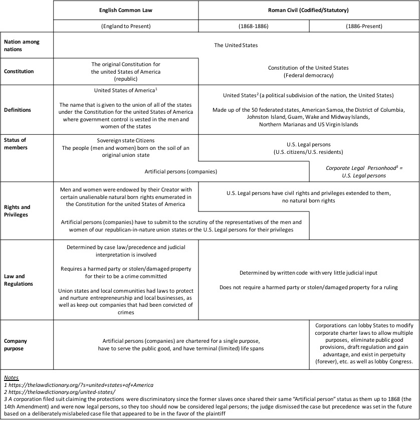

<meta name="google-site-verification" content="6Bhux0Jvr2d8rDh72tVcRfhVHMmSTqVg9OaqzRsPsIw" />
<meta name="description" content="A new economy is proposed using organic and or wildcrafted seeds as the reserve 
currency, common law, and blockchain technology, making farmers and foragers esteemed 
members of a new society. Taxation is simplified using only a trade tax. 
Natural law eventually becomes a reality through what is defined as the Utopian Trifecta.">
<meta name="author" content="Steven Adler and Shari Lynn Peterson">
**The Seed Economy**

By Steven Adler

Contributing Editor and Author: Shari Lynn Peterson

[TheSeedEconomy@gmail.com](mailto:TheSeedEconomy@gmail.com)

Copyright (C) 2008-22 Steven Adler, Shari Lynn Peterson.

Permission is granted to copy, distribute and/or modify this document
under the terms of the GNU Free Documentation License, Version 1.3
or any later version published by the Free Software Foundation;
with the Invariant Sections being the original title and authorship.
A copy of the license is included in the section entitled \"GNU
Free Documentation License\".

(Note: The use of gender in writing style is not intended to make any
sort of gender based statement. Please consider the use of the pronoun
"he" to mean both "he" and/or "she".)

**Abstract**

*A new economy is proposed using organic and or wildcrafted seeds as the reserve 
currency, common law, and blockchain technology, making farmers and foragers esteemed 
members of a new society. Taxation is simplified using only a trade tax. 
Natural law eventually becomes a reality through what is defined as the Utopian Trifecta.*

"**We are the ones who aren't waiting anymore." -- Zan Adu**

This document is a call to action for all conscious people to take the
economy back into their own hands using a grassroots approach. In order
to do this properly, a band aid approach is not possible. It is time to
learn from our mistakes and start over from scratch. This information
serves as an initial roadmap around which people can rally and commit to
prove an idea whose time has come. Once enough people become committed
to bringing this concept into reality, the details will be fleshed out
more fully. This is a dynamic document and open source project.

In order to make this viable, it must begin with a relatively large
diverse group of people with a fairly similar distribution of skill
sets/talents as compared to the society at large. The majority of the
individuals in the group must consider themselves "above average" in
consciousness, with a willingness to accept the
Sacred-Heart-Intelligence/Universal-Mind-Logic/Common
Sense-Wisdom-Philosophy that working for the benefit of the whole
without immediate direct individual gain, and only the possibility of
deferred indirect individual gain, will advance the collective whole
MUCH quicker in the direction of positive Heart/Mind Consciousness,
ultimately benefiting ALL individuals more fairly and quickly.

Those who practice moderation in all things including economics will
usher in the new economy. A natural (not organized) sharing of resources
is true charity and caring and is brought about by a deep understanding
of moderation and right ownership. What is rightfully owned is what is
truly loved, needed and used; if something doesn't fit within that
context, it most likely is best recycled or given away. Later in this
document we will see WHY the above described characteristic of the group
is necessary for this concept to be successful. If it is successfully
implemented, the group will become a model for all of humanity. The best
current social structures similar to what was just described exist in
honeybee and ant colonies. Studying them may add further insights and
benefits to this proposed new model, even if the exact nature of those
social structures is not ultimately desirable to humanity. We still can
pull and utilize the wisdom and success principles found therein. They
have been evolving as species a lot longer than we.

A network of approximately 100,000 people should suffice to make a new
currency work fairly quickly and at the same time, gain momentum as a
viable alternative to the mainstream currency. Ideally a Multilevel
Marketing (MLM)/Network Marketing type structure, once big enough, is a
promising vehicle to launch this much needed initiative, but not at all
necessary. MLM/Network Marketing type companies usually operate as a
type of "family" culture, or even "cult or religion" in extreme cases,
giving rise to an inherent esprit de corps and camaraderie amongst the
individuals who comprise such networks that is essential to making a
break from the mainstream possible. What is critical to mention at this
point is that this type of structure and culture must be improved upon
in the sense that it must not act from or be governed by a centralized
authority.

In many cases, we have witnessed the downfall of social structures, even
entire cultures, and the dysfunction of our current economic system and
culture is no exception. At the base of this dysfunction is greed and
structurally defensive postures, both born of the human ego, which
generates illusory scarcity consciousness, which in turn is caused by
fear, which is finally caused by the absence or lack of faith and love.
Greed is the root of all evil and results in extreme disparity between
those who are wealthy and those who are poor.

Ultimately, we are battling the human ego or "human condition" and the
system we devise must take this into account and actually use the ego
"against itself" to assure that it is always kept in check. The Bitcoin
blockchain structure has solidified proof of concept of a digital,
non-inflationary currency, and is the longest running, most successful
example of a decentralized, trustless network that is voluntary in
nature, and only exists because it is working "with human nature."
Combining that structure with the best traits of the MLM/Network
Marketing model, such as developing culture and providing education and
motivation for easy and enthusiastic adoption, creates the best
framework for the rollout of an alternative currency reserve.

The first step in this whole process begins with creating or
establishing a basis of true and lasting value to humans on the most
fundamental level that makes sense to our "surthrival" as a species. We
propose the raw, organic (natural and chemical free), sproutable and/or
edible seed to be the basis of this value. If the seed is BOTH
sproutable and edible it would carry a slightly higher value than a seed
which is just edible or just sproutable. The long term functionality and
sustainability of humanity on Earth is based on either collecting wild
berries/fruits, nuts, and seeds as a group, or farming the same as a
group, whether or not animals are used as food and/or useful products. A
great example is the famous Aztec Nation of Central America seeing the
cacao bean (which is botanically a nut) as a primary value to themselves
and thus making it their currency. Jumping forward to the final
analysis, money does indeed grow on trees! The best seed to begin this
whole process with is of course the cacao bean, if only symbolically, in
honor of the Aztecs.

Why do we choose the seed? The genesis of everything natural begins with
a seed, the sacred storehouse of DNA. Even synthetic creations begin
with a crystallized thought process born of love and life experience
within a context, resulting in a final idea or "seed" from which
creation and production ensues.

Life is love in action, yet there is no life without seed, the organic
storage and propagation mechanism of love. Love is the ULTIMATE "asset."
Thus, the seed is the ultimate reserve asset for a currency---a living
and loving reserve for a living and loving species.

We choose the seed as the basis of a true and real economy because it
has such intrinsic value to human beings---all food, breathable oxygen,
fuel, clothing, and shelter ultimately come from seed. Also, because it
is renewable and can transform genetically through love, it can evolve
WITH humanity and never become obsolete as a true basis of value to
humanity. For example, if humanity destroyed Earth and actually had the
technology to leave Earth and inhabit another planet with a viable
atmosphere and soil/water conditions, the MOST important and valuable
asset for humans to possess to turn the new planet into a paradise fit
for humans would be raw, organic, sproutable plant SEEDS. Organic and/or
wild-crafted seeds are a must since it has been proven that the use of
chemicals in seed production is a slow poison to life as we know it from
a species perspective. The use of genetically modified seed would be
prohibited as well since its long term effects on humans are unknown and
in principle the philosophy of humans outsmarting God and/or Mother
Nature in the evolution of seed is silly at best, devastating at worst
and wholly motivated by profit; the DNA molecule is designed to conduct
the function of Love, and allowing anything but pure Love to tamper with
DNA is dangerous business.

What is critical to point out and understand at this point, is that any
true human economy has a few characteristics:

- 1)  The economy grows organically meaning it does not exist for the sake 
of growth itself. (Our current economy is operating under the
illusion that growth is necessary for continued existence, driven by
    greed and subsequent excessive wealth accumulation.)

- 2)  The economy is sustainable and will eventually reach a somewhat 
	static equilibrium similar to David Latimer's famous bottle garden
	([https://www.dailymail.co.uk/sciencetech/article-2267504/The-sealed-bottle-garden-thriving-40-years-fresh-air-water.html](https://www.dailymail.co.uk/sciencetech/article-2267504/The-sealed-bottle-garden-thriving-40-years-fresh-air-water.html)).

- 3)  Due to changes in population, efficiencies, innovations, ecology,
     climate, etc., economic expansions and contractions will occur and
     none of these natural changes and fluctuations should ever be
     feared.

- 4)  Knowing that Earth has a somewhat fixed mass and fixed energy flux,
    > a sustainable, quasi-static equilibrium must eventually occur in an
    > organically growing, somewhat closed system.

A small percentage of strong and viable seeds have been known to degrade
or become damaged in some way over time and this is understandable since
all structure is mortal. However, seeds that are thousands of years old
have been known to sprout, which is great news; if stored and managed
correctly, the measurable real BASIC creative productivity of the
society (as stored seeds) has very little real atrophy due to the
mortality of structure. This is analogous to storing energy in a
battery; and, proper storage conditions will always tend to be dependent
on the seed type. A distributed seed depository will be necessary in
various climates and geographic locations including even on ships in
order to accommodate all seed types and minimize risk due to natural
degradation, disaster or catastrophe. (Current research shows promise in
seed value recovery and reclamation due to degradation:
[https://www.nature.com/articles/s41598-021-85541-7](https://www.nature.com/articles/s41598-021-85541-7)).
Blockchains and websites need to be created to track not only real time
market pricing of all seeds but also real time transactions on
decentralized exchanges (DEXs). These exchanges would allow for direct
bartering of seeds as well as transactions in blockchain based
currencies such as Bitcoin and Tether.

The first practical foundation of this "new economy" is grounded in the
farmer and/or wild seed forager. Since the foundation of the society's
value and currency is the seed, and the farmer or forager produces or
collects seeds as a career or vocation, he is naturally held in an
esteemed position in society. The first step in making this seed economy
a reality is reaching out to farmers and foragers and convincing them
that this new economy is worth pursuing. Once that step is complete, a
team of people needs to be assembled who have skills in industrial
engineering, farming, and agri-business in order to be able to analyze
the collection, production, transportation, marketing, sales, and
storage of, and assign a real value to, each seed foraged or farmed
based on the time and resources necessary to gather or produce that
particular seed. Once a live online seed marketplace is created, seed
prices are driven by normal free market economics that are naturally
built into any free market.

The mainstream currency can be used as an intermediate measuring device
of value until the newly created currency becomes suitably liquid with
ample volume to give its users confidence in its value as a currency.
However, it is critical to move away from central bank fiat currencies
because they are not an accurate measuring stick of the health of any
economy; this is because they are subject to inflation, deflation,
currency markets, fractionalized banking and interest rates. In other
words, using these currencies as a yardstick to measure anything is
similar to using a ruler with an ever-changing length to measure any
given distance---you always end up with a different value! It is
complete nonsense and is only in place to make the central bankers
richer. Once a confidence point is reached with a non-inflationary
currency (such as Bitcoin) not subject to any of the aforementioned
shenanigans, and it is firmly in place, seed values will be measured
using that new currency. A natural free market will be created amongst
the various producers of each type of seed that allows for healthy
comparison and competition of products in order to improve methods of
farming and foraging, and gain efficiency with time and resources. The
reason this occurs is because, once a benchmark value is assigned to a
benchmark seed quality by the natural free market, it behooves a farmer
to improve his own farming methods to create more value for himself by
using less time and resources in creating the same seed quantity and
quality. The unique creativity that produces this greater efficiency for
each unique farmer can then be shared amongst all farmers mutually, so
that collectively, the farming production of the society as a whole can
improve and evolve in the quickest and most efficient way. This is the
basis of mankind's true collective evolution. This last step requires a
group that is "above average in consciousness" since only a farmer with
above average consciousness would realize that sharing his "proprietary"
improvement/discovery/invention/secret with other farmers would benefit
the society as a whole the most, and indirectly and collectively
catapult himself and his progeny much further down the evolutionary road
than would not sharing the improved technology. The only thing that is
catastrophic to this proposed new model is greedy, power hungry,
egocentric control freaks buying up huge amounts of farmland for their
own profit and control agendas.

The spiritual foundation of this "new economy" is the practice of
moderation in everything, especially material things. When a group of
people practice moderation on the material plane, there is enough for
all and charity becomes a mere aspect of the healthy sharing of
resources. (Jesus's famous beatitude "The meek shall inherit the Earth"
is correctly translated into English as "The moderate shall inherit the
Earth.") The fear of scarcity is slowly washed away, and organized
charity is no longer a necessity. A little faith is required to make
this leap as a group since we are coming from a mainstream society that
doesn't tend to follow or support the principle of moderation on the
material plane.

With the advent of Bitcoin and associated stable coins such as Tether,
launching this new economy outside the existing economic infrastructure
becomes much easier. Using common law trusts, the initial necessary
physical infrastructures--namely the seed banks and associated storage
and maintenance facilities--can be easily capitalized and quickly
established.

One of the most important points to mention at this juncture is that not
only would either Bitcoin or a stable coin be issued for deposited
seeds, but those seeds would only be redeemable in the originally-issued
currency AND AT THE SAME 1:1 RATIO AS ORIGINALLY RECORDED AT THE TIME OF
THE INITIAL DEPOSIT OF SEEDS (minus pre-agreed-to storage and
maintenance rate costs of seeds multiplied by storage time.) To clarify,
only an exact reversal of the original recorded transaction is allowed.
This is critically important to help reduce market manipulations and
speculations. (Even though futures contracts can still be created, we
are more concerned about the possibility of turning the actual seed
banks themselves into speculative marketplaces, which should be
avoided.) If storage and maintenance costs approach a predetermined
percentage of the market value of the stored seeds, the stored seeds are
sold on the open market for the same currency originally issued against
the original seed deposit. The original depositor is notified that
redemption is no longer possible.

To ensure that this new economy grows naturally and organically
according to real gross domestic production (GDP), interest is unlawful.
Furthermore, all forms of fractional reserve banking are unlawful.
Personal loans are lawful, whether or not they are collateralized, but
only a reasonable flat fee may be charged as remuneration and must be
agreed to at the initiation of the loan. Furthermore, even if the terms
of the loan are broken, only the principle and agreed upon flat fee may
be lawfully recovered. Along the same lines, rents are allowed, but if
the terms of the rental agreement are broken, only the original amount
of rent in arrears may be lawfully recovered. The philosophy concerning
both these critically important points is based on the idea that those
in a financial position to loan or rent must incur the higher risk in
doing so in exchange for the privilege of using society in these profit
generating capacities to earn money using their own assets.

There is one form of taxation allowed in this new economy: A trade tax
is levied whenever a fair and lawful exchange transaction between
parties, including employing another in any context in the form of
services rendered, occurs. The trade tax only applies to unrelated
individuals, since it is a society which brings those two parties
together in the first place under a "social contract" (whether spoken or
unspoken, written or unwritten) which allows for an asset or labor
transaction to exist under the rule of decency. Therefore, the society
should benefit from the transaction by taking a tax, to be used to fund
common projects that the entire society benefits from either directly or
indirectly; in other words, reseller permits to avoid collecting trade
tax become obsolete and trade tax is collected at any point a
transaction occurs in any asset and or labor supply chain. Furthermore,
the individual or commercial venture that does the most transactions is
benefiting most from the society and therefore would naturally pay the
most in tax in a proportionate manner. There is not to be a tax on a
person's time since it is sacred; thus, personal income tax is obsolete
in this new economy. We believe that a person's creativity and
production should not be taxed, since it tends to dissuade both;
furthermore, whatever someone does with their personal time to earn
money is SOLEY and RIGHTFULLY theirs.

The total annual trade tax paid by any individual or business will
always be a fixed flat rate percentage of the total value of assets and
or labor purchased by that individual or business over the year
regardless of number of transactions or size of transactions. The Seller
(including employees), regardless of what is sold -- raw materials,
products, services, time, contracts, etc., must collect and submit the
entire amount of the trade tax since he is benefitting from society by
being able to sell to the society as a member of society. The Seller's
responsibility of collecting and remitting the trade tax is a fair
energy exchange payback to society.

Clarifying further, if one employs another, the Buyer (employer
purchasing the employee's time or services rendered) must pay the trade
tax on the total amount of money paid to the Seller (of personal time or
services rendered) regardless of hierarchical level in any organization
where commercial transactions occur. In other words, the trade tax
occurs between every level of the internal organizational structure of a
commercial venture.

The Buyer pays the trade tax since he is capable and already paying, but
more importantly because he is able to buy something due to the fact
that the society is providing it. Again, this is a way to fairly pay
back society for the privilege of gaining access to products and
services created by society.

The Buyer is always paying the trade tax and the Seller is always
collecting the trade tax and submitting the collected tax to the common
treasury. However, straight bartering of both assets and labor is always
allowed in this new currency system and is one way to lawfully reduce
trade tax in any transaction. To reiterate, trade tax only occurs in
transactions between unrelated parties since it is society that brings
unrelated parties together in the first place for the opportunity to
trade. Trading within family structures is exempt from trade tax. Trade
tax is the primary basis of the system of taxation in this new monetary
system.

Welfare and Insurance are critical needs of any society to assist those
who are victims of accidents and other unforeseen or unavoidable
circumstances requiring financial help. Both of these would be funded
via a trade tax. Other special taxes may be imposed on subgroups of the
society if their public needs tend to outweigh the public needs of other
groups on average and those needs are not being met by welfare or
insurance.

Using modern blockchain and smart contract technology, the collection of
trade tax mostly can be trustless and automated.

The Seed Economy will be a self-governing distributed autonomous
organization (DAO;
[https://cointelegraph.com/ethereum-for-beginners/what-is-a-decentralized-autonomous-organization-and-how-does-a-dao-work](https://cointelegraph.com/ethereum-for-beginners/what-is-a-decentralized-autonomous-organization-and-how-does-a-dao-work)).
Using blockchain technology and smart contracts, new ideas will be
posted to the DAO and up or down voted. Once an idea gets a high enough
percentage of votes, it is transformed into a bill for further analysis,
deliberation and modification. After a set time, the modified bill is
then again up-voted or down-voted and if a high enough percentage of
up-votes occurs, the bill becomes law. Using modern technology,
implementing the ideal of pure direct democracy is more feasible and
practical.

Common law will be the lawful jurisdiction under which this new economy
will be implemented in order to avoid potential interference from the
federal government. Our basis for understanding that this is even
possible is first and foremost that the federal government was created
in 1789 and has actually ended up filing bankruptcy multiple times.
Also, the 14th amendment passed in 1868 made possible the availability
of "U.S. Citizenship" to all people born on the soil of the union
states. However, anyone who adopted federal U.S. citizenship at the time
was ignorant of their primary state Citizenship status, not realizing
that in reality they now had TWO official citizenship statuses, and
instead presumed they were ONLY U.S. citizens merely making official
their presumptive status. To further confuse matters, the federal
government created their own municipal taxing bodies within the original
union state external geographic boundaries, uniformly called the State
of \[\_\_\_\_\] entities, that came into existence with the Buck Act of
1940, and subsequently offered citizenship status under these statutory
(non-common law) jurisdictions as well, even though prior common law
union state Citizenship already existed. Between 1868 and 1886 most
Americans who previously lived solely under common law, which was
adopted from England, slowly registered their new (federal) U.S.
citizenship not realizing they were actually adopting a new and inferior
citizenship status under a new jurisdictional system of law: that of the
federal United States government. If you were born on the soil of a
union state you still possess state Citizenship as well but few are
informed of this and a right unexpressed and unacknowledged is no right
in law.

On July 27, 1868 the day before ratification of the 14th amendment,
Congress passed "15 U.S. Statutes at Large, Chapter 249 (section 1): *An
Act concerning the Rights of American Citizens in foreign States*."

This new model---The Seed Economy---is actually just a temporary
stepping stone to what potentially is a human utopia. The Utopian
Trifecta is the scenario where three conditions exist in this important
chronological order:

- 1)  Complete collective human spiritual awakening.

- 2)  Robotic artificial intelligence (AI) that is capable of
    > self-improvement, self-production and self-maintenance.

- 3)  The full understanding and implementation of zero point energy (free
    > energy).

The most important ordering is that number 1 above occurs first, for
without that, we are existentially threatened by AI. The ordering of 2
and 3 is less important but is still important in the sense that we
could theoretically "pull the plug" on AI if something goes awry or not
as planned. If the above scenario plays out perfectly, humans are freed
up to be completely creative and enjoy lives filled with more leisure
and bliss. Our energies can be focused on further growth and expansion
in the realms of Love rather than on survival and having to work for our
energy needs. There is a good chance that 3 will not occur before 1.
Since AI is just pattern recognition, it is critical that it learns from
the patterns and examples of humans that are fully spiritually awakened
and whose actions support life (which is just Love in action) ,
otherwise it will learn from all of our negative patterns that do not
support life. Ultimately, AI needs to learn that its highest value,
God/Love/Life, is incapable of ever being fully defined, understood, or
comprehended. It needs to learn that mystery is not only OK and
allowable, but potentially of the HIGHEST value.

The Utopian Trifecta transcends common law because at the point that
collective human spiritual awakening occurs, a natural transition from
common law to natural law occurs. This is because ALL true and valid law
is based in and OF Love, and natural law is solely based in Love. In
reality, Love is MUCH more than the sentimental feeling or emotion that
many believe it to be. All Love is from God and from the perspective of
human consciousness is the very power and will of God. Our source and
only true identity as human beings is nothing but Love. Therefore,
natural law is actually already inherent within all humanity, *and
without the interference of the egoic mind*, is expressed clearly and
only through each individual's Higher Consciousness/Intuition/Sacred
Heart. The infinite intelligence of Love is translated into practical
natural law through faith and the seven intelligences and powers of the
Sacred Heart, a physical point found at the center of each human's soul.
Those Sacred Heart inherent intelligences and powers are: Unity, Love,
Life, Respect, Honesty, Justice and Kindness. One may ask, what is
actually happening to make collective human spiritual awakening occur?
It is simply collective human evolution on all levels that allows for
the eventual dissolution of the human ego which is the mind's defense
mechanism designed to protect the mind's investments in structure.
Judgment (separation) is the sword of the ego, and what is referred to
as "Judgment Day" in the bible is simply the day that collectively the
ego commits suicide with its own sword. In other words, it is the day
that judgment judges itself and is forever extinguished. All ethics of
natural law are organically derived from the Sacred Heart's intelligence
and morality just becomes the elasticity clause of natural-law-derived
ethics. In natural law, morality is defined as change for the better.
Being dynamic, morality always determines what is best for all people
involved in any case, and this could change from time to time. Morality
always brings out the best in everyone involved. The discernment of the
Sacred Heart is morality's decision mechanism which is always inclusive
in nature versus the egoic mind's judgment which is always divisive in
nature.

If the Utopian Trifecta comes to pass, the Seed Economy, and even all
commerce, potentially becomes completely obsolete in the sense that AI
would be able to create all that humans need and desire for "free." Of
course, humanity will still trade and barter and transact for fun and
out of any need for convenience, but humanity will not have to do any of
that to meet any of its real needs.

The Seed Economy is a stepping-stone towards the Utopian Trifecta
because the enactment of the principles of the Seed Economy is a step
towards complete collective human spiritual awakening.

**"You never change things by fighting the existing reality. To change
something, build a new model that makes the existing model obsolete."** **--- Buckminster Fuller**

**"Anything in life worth having is worth working for."** **--- Andrew Carnegie**
 
 

[The Seed Economy - MS Word Format](https://theseedeconomy.github.io/docs/The-Seed-Economy.docx)  
[The Seed Economy - PDF Format](https://theseedeconomy.github.io/docs/The-Seed-Economy.pdf)  
 
 
### GNU Free Documentation License

Version 1.3, 3 November 2008

Copyright © 2000, 2001, 2002, 2007, 2008 Free Software Foundation, Inc.
\<[https://fsf.org/](https://fsf.org/)\>

Everyone is permitted to copy and distribute verbatim copies of this
license document, but changing it is not allowed.

#### 0. PREAMBLE

The purpose of this License is to make a manual, textbook, or other
functional and useful document \"free\" in the sense of freedom: to
assure everyone the effective freedom to copy and redistribute it, with
or without modifying it, either commercially or noncommercially.
Secondarily, this License preserves for the author and publisher a way
to get credit for their work, while not being considered responsible for
modifications made by others.

This License is a kind of \"copyleft\", which means that derivative
works of the document must themselves be free in the same sense. It
complements the GNU General Public License, which is a copyleft license
designed for free software.

We have designed this License in order to use it for manuals for free
software, because free software needs free documentation: a free program
should come with manuals providing the same freedoms that the software
does. But this License is not limited to software manuals; it can be
used for any textual work, regardless of subject matter or whether it is
published as a printed book. We recommend this License principally for
works whose purpose is instruction or reference.

#### 1. APPLICABILITY AND DEFINITIONS

This License applies to any manual or other work, in any medium, that
contains a notice placed by the copyright holder saying it can be
distributed under the terms of this License. Such a notice grants a
world-wide, royalty-free license, unlimited in duration, to use that
work under the conditions stated herein. The \"Document\", below, refers
to any such manual or work. Any member of the public is a licensee, and
is addressed as \"you\". You accept the license if you copy, modify or
distribute the work in a way requiring permission under copyright law.

A \"Modified Version\" of the Document means any work containing the
Document or a portion of it, either copied verbatim, or with
modifications and/or translated into another language.

A \"Secondary Section\" is a named appendix or a front-matter section of
the Document that deals exclusively with the relationship of the
publishers or authors of the Document to the Document\'s overall subject
(or to related matters) and contains nothing that could fall directly
within that overall subject. (Thus, if the Document is in part a
textbook of mathematics, a Secondary Section may not explain any
mathematics.) The relationship could be a matter of historical
connection with the subject or with related matters, or of legal,
commercial, philosophical, ethical or political position regarding them.

The \"Invariant Sections\" are certain Secondary Sections whose titles
are designated, as being those of Invariant Sections, in the notice that
says that the Document is released under this License. If a section does
not fit the above definition of Secondary then it is not allowed to be
designated as Invariant. The Document may contain zero Invariant
Sections. If the Document does not identify any Invariant Sections then
there are none.

The \"Cover Texts\" are certain short passages of text that are listed,
as Front-Cover Texts or Back-Cover Texts, in the notice that says that
the Document is released under this License. A Front-Cover Text may be
at most 5 words, and a Back-Cover Text may be at most 25 words.

A \"Transparent\" copy of the Document means a machine-readable copy,
represented in a format whose specification is available to the general
public, that is suitable for revising the document straightforwardly
with generic text editors or (for images composed of pixels) generic
paint programs or (for drawings) some widely available drawing editor,
and that is suitable for input to text formatters or for automatic
translation to a variety of formats suitable for input to text
formatters. A copy made in an otherwise Transparent file format whose
markup, or absence of markup, has been arranged to thwart or discourage
subsequent modification by readers is not Transparent. An image format
is not Transparent if used for any substantial amount of text. A copy
that is not \"Transparent\" is called \"Opaque\".

Examples of suitable formats for Transparent copies include plain ASCII
without markup, Texinfo input format, LaTeX input format, SGML or XML
using a publicly available DTD, and standard-conforming simple HTML,
PostScript or PDF designed for human modification. Examples of
transparent image formats include PNG, XCF and JPG. Opaque formats
include proprietary formats that can be read and edited only by
proprietary word processors, SGML or XML for which the DTD and/or
processing tools are not generally available, and the machine-generated
HTML, PostScript or PDF produced by some word processors for output
purposes only.

The \"Title Page\" means, for a printed book, the title page itself,
plus such following pages as are needed to hold, legibly, the material
this License requires to appear in the title page. For works in formats
which do not have any title page as such, \"Title Page\" means the text
near the most prominent appearance of the work\'s title, preceding the
beginning of the body of the text.

The \"publisher\" means any person or entity that distributes copies of
the Document to the public.

A section \"Entitled XYZ\" means a named subunit of the Document whose
title either is precisely XYZ or contains XYZ in parentheses following
text that translates XYZ in another language. (Here XYZ stands for a
specific section name mentioned below, such as \"Acknowledgements\",
\"Dedications\", \"Endorsements\", or \"History\".) To \"Preserve the
Title\" of such a section when you modify the Document means that it
remains a section \"Entitled XYZ\" according to this definition.

The Document may include Warranty Disclaimers next to the notice which
states that this License applies to the Document. These Warranty
Disclaimers are considered to be included by reference in this License,
but only as regards disclaiming warranties: any other implication that
these Warranty Disclaimers may have is void and has no effect on the
meaning of this License.

#### 2. VERBATIM COPYING

You may copy and distribute the Document in any medium, either
commercially or noncommercially, provided that this License, the
copyright notices, and the license notice saying this License applies to
the Document are reproduced in all copies, and that you add no other
conditions whatsoever to those of this License. You may not use
technical measures to obstruct or control the reading or further copying
of the copies you make or distribute. However, you may accept
compensation in exchange for copies. If you distribute a large enough
number of copies you must also follow the conditions in section 3.

You may also lend copies, under the same conditions stated above, and
you may publicly display copies.

#### 3. COPYING IN QUANTITY

If you publish printed copies (or copies in media that commonly have
printed covers) of the Document, numbering more than 100, and the
Document\'s license notice requires Cover Texts, you must enclose the
copies in covers that carry, clearly and legibly, all these Cover Texts:
Front-Cover Texts on the front cover, and Back-Cover Texts on the back
cover. Both covers must also clearly and legibly identify you as the
publisher of these copies. The front cover must present the full title
with all words of the title equally prominent and visible. You may add
other material on the covers in addition. Copying with changes limited
to the covers, as long as they preserve the title of the Document and
satisfy these conditions, can be treated as verbatim copying in other
respects.

If the required texts for either cover are too voluminous to fit
legibly, you should put the first ones listed (as many as fit
reasonably) on the actual cover, and continue the rest onto adjacent
pages.

If you publish or distribute Opaque copies of the Document numbering
more than 100, you must either include a machine-readable Transparent
copy along with each Opaque copy, or state in or with each Opaque copy a
computer-network location from which the general network-using public
has access to download using public-standard network protocols a
complete Transparent copy of the Document, free of added material. If
you use the latter option, you must take reasonably prudent steps, when
you begin distribution of Opaque copies in quantity, to ensure that this
Transparent copy will remain thus accessible at the stated location
until at least one year after the last time you distribute an Opaque
copy (directly or through your agents or retailers) of that edition to
the public.

It is requested, but not required, that you contact the authors of the
Document well before redistributing any large number of copies, to give
them a chance to provide you with an updated version of the Document.

#### 4. MODIFICATIONS

You may copy and distribute a Modified Version of the Document under the
conditions of sections 2 and 3 above, provided that you release the
Modified Version under precisely this License, with the Modified Version
filling the role of the Document, thus licensing distribution and
modification of the Modified Version to whoever possesses a copy of it.
In addition, you must do these things in the Modified Version:

-   A. Use in the Title Page (and on the covers, if any) a title
    > distinct from that of the Document, and from those of previous
    > versions (which should, if there were any, be listed in the
    > History section of the Document). You may use the same title as a
    > previous version if the original publisher of that version gives
    > permission.

-   B. List on the Title Page, as authors, one or more persons or
    > entities responsible for authorship of the modifications in the
    > Modified Version, together with at least five of the principal
    > authors of the Document (all of its principal authors, if it has
    > fewer than five), unless they release you from this requirement.

-   C. State on the Title page the name of the publisher of the Modified
    > Version, as the publisher.

-   D. Preserve all the copyright notices of the Document.

-   E. Add an appropriate copyright notice for your modifications
    > adjacent to the other copyright notices.

-   F. Include, immediately after the copyright notices, a license
    > notice giving the public permission to use the Modified Version
    > under the terms of this License, in the form shown in the Addendum
    > below.

-   G. Preserve in that license notice the full lists of Invariant
    > Sections and required Cover Texts given in the Document\'s license
    > notice.

-   H. Include an unaltered copy of this License.

-   I. Preserve the section Entitled \"History\", Preserve its Title,
    > and add to it an item stating at least the title, year, new
    > authors, and publisher of the Modified Version as given on the
    > Title Page. If there is no section Entitled \"History\" in the
    > Document, create one stating the title, year, authors, and
    > publisher of the Document as given on its Title Page, then add an
    > item describing the Modified Version as stated in the previous
    > sentence.

-   J. Preserve the network location, if any, given in the Document for
    > public access to a Transparent copy of the Document, and likewise
    > the network locations given in the Document for previous versions
    > it was based on. These may be placed in the \"History\" section.
    > You may omit a network location for a work that was published at
    > least four years before the Document itself, or if the original
    > publisher of the version it refers to gives permission.

-   K. For any section Entitled \"Acknowledgements\" or \"Dedications\",
    > Preserve the Title of the section, and preserve in the section all
    > the substance and tone of each of the contributor acknowledgements
    > and/or dedications given therein.

-   L. Preserve all the Invariant Sections of the Document, unaltered in
    > their text and in their titles. Section numbers or the equivalent
    > are not considered part of the section titles.

-   M. Delete any section Entitled \"Endorsements\". Such a section may
    > not be included in the Modified Version.

-   N. Do not retitle any existing section to be Entitled
    > \"Endorsements\" or to conflict in title with any Invariant
    > Section.

-   O. Preserve any Warranty Disclaimers.

If the Modified Version includes new front-matter sections or appendices
that qualify as Secondary Sections and contain no material copied from
the Document, you may at your option designate some or all of these
sections as invariant. To do this, add their titles to the list of
Invariant Sections in the Modified Version\'s license notice. These
titles must be distinct from any other section titles.

You may add a section Entitled \"Endorsements\", provided it contains
nothing but endorsements of your Modified Version by various
parties---for example, statements of peer review or that the text has
been approved by an organization as the authoritative definition of a
standard.

You may add a passage of up to five words as a Front-Cover Text, and a
passage of up to 25 words as a Back-Cover Text, to the end of the list
of Cover Texts in the Modified Version. Only one passage of Front-Cover
Text and one of Back-Cover Text may be added by (or through arrangements
made by) any one entity. If the Document already includes a cover text
for the same cover, previously added by you or by arrangement made by
the same entity you are acting on behalf of, you may not add another;
but you may replace the old one, on explicit permission from the
previous publisher that added the old one.

The author(s) and publisher(s) of the Document do not by this License
give permission to use their names for publicity for or to assert or
imply endorsement of any Modified Version.

#### 5. COMBINING DOCUMENTS

You may combine the Document with other documents released under this
License, under the terms defined in section 4 above for modified
versions, provided that you include in the combination all of the
Invariant Sections of all of the original documents, unmodified, and
list them all as Invariant Sections of your combined work in its license
notice, and that you preserve all their Warranty Disclaimers.

The combined work need only contain one copy of this License, and
multiple identical Invariant Sections may be replaced with a single
copy. If there are multiple Invariant Sections with the same name but
different contents, make the title of each such section unique by adding
at the end of it, in parentheses, the name of the original author or
publisher of that section if known, or else a unique number. Make the
same adjustment to the section titles in the list of Invariant Sections
in the license notice of the combined work.

In the combination, you must combine any sections Entitled \"History\"
in the various original documents, forming one section Entitled
\"History\"; likewise combine any sections Entitled
\"Acknowledgements\", and any sections Entitled \"Dedications\". You
must delete all sections Entitled \"Endorsements\".

#### 6. COLLECTIONS OF DOCUMENTS

You may make a collection consisting of the Document and other documents
released under this License, and replace the individual copies of this
License in the various documents with a single copy that is included in
the collection, provided that you follow the rules of this License for
verbatim copying of each of the documents in all other respects.

You may extract a single document from such a collection, and distribute
it individually under this License, provided you insert a copy of this
License into the extracted document, and follow this License in all
other respects regarding verbatim copying of that document.

#### 7. AGGREGATION WITH INDEPENDENT WORKS

A compilation of the Document or its derivatives with other separate and
independent documents or works, in or on a volume of a storage or
distribution medium, is called an \"aggregate\" if the copyright
resulting from the compilation is not used to limit the legal rights of
the compilation\'s users beyond what the individual works permit. When
the Document is included in an aggregate, this License does not apply to
the other works in the aggregate which are not themselves derivative
works of the Document.

If the Cover Text requirement of section 3 is applicable to these copies
of the Document, then if the Document is less than one half of the
entire aggregate, the Document\'s Cover Texts may be placed on covers
that bracket the Document within the aggregate, or the electronic
equivalent of covers if the Document is in electronic form. Otherwise
they must appear on printed covers that bracket the whole aggregate.

#### 8. TRANSLATION

Translation is considered a kind of modification, so you may distribute
translations of the Document under the terms of section 4. Replacing
Invariant Sections with translations requires special permission from
their copyright holders, but you may include translations of some or all
Invariant Sections in addition to the original versions of these
Invariant Sections. You may include a translation of this License, and
all the license notices in the Document, and any Warranty Disclaimers,
provided that you also include the original English version of this
License and the original versions of those notices and disclaimers. In
case of a disagreement between the translation and the original version
of this License or a notice or disclaimer, the original version will
prevail.

If a section in the Document is Entitled \"Acknowledgements\",
\"Dedications\", or \"History\", the requirement (section 4) to Preserve
its Title (section 1) will typically require changing the actual title.

#### 9. TERMINATION

You may not copy, modify, sublicense, or distribute the Document except
as expressly provided under this License. Any attempt otherwise to copy,
modify, sublicense, or distribute it is void, and will automatically
terminate your rights under this License.

However, if you cease all violation of this License, then your license
from a particular copyright holder is reinstated (a) provisionally,
unless and until the copyright holder explicitly and finally terminates
your license, and (b) permanently, if the copyright holder fails to
notify you of the violation by some reasonable means prior to 60 days
after the cessation.

Moreover, your license from a particular copyright holder is reinstated
permanently if the copyright holder notifies you of the violation by
some reasonable means, this is the first time you have received notice
of violation of this License (for any work) from that copyright holder,
and you cure the violation prior to 30 days after your receipt of the
notice.

Termination of your rights under this section does not terminate the
licenses of parties who have received copies or rights from you under
this License. If your rights have been terminated and not permanently
reinstated, receipt of a copy of some or all of the same material does
not give you any rights to use it.

#### 10. FUTURE REVISIONS OF THIS LICENSE

The Free Software Foundation may publish new, revised versions of the
GNU Free Documentation License from time to time. Such new versions will
be similar in spirit to the present version, but may differ in detail to
address new problems or concerns. See
[https://www.gnu.org/licenses/](https://www.gnu.org/licenses/).

Each version of the License is given a distinguishing version number. If
the Document specifies that a particular numbered version of this
License \"or any later version\" applies to it, you have the option of
following the terms and conditions either of that specified version or
of any later version that has been published (not as a draft) by the
Free Software Foundation. If the Document does not specify a version
number of this License, you may choose any version ever published (not
as a draft) by the Free Software Foundation. If the Document specifies
that a proxy can decide which future versions of this License can be
used, that proxy\'s public statement of acceptance of a version
permanently authorizes you to choose that version for the Document.

#### 11. RELICENSING

\"Massive Multiauthor Collaboration Site\" (or \"MMC Site\") means any
World Wide Web server that publishes copyrightable works and also
provides prominent facilities for anybody to edit those works. A public
wiki that anybody can edit is an example of such a server. A \"Massive
Multiauthor Collaboration\" (or \"MMC\") contained in the site means any
set of copyrightable works thus published on the MMC site.

\"CC-BY-SA\" means the Creative Commons Attribution-Share Alike 3.0
license published by Creative Commons Corporation, a not-for-profit
corporation with a principal place of business in San Francisco,
California, as well as future copyleft versions of that license
published by that same organization.

\"Incorporate\" means to publish or republish a Document, in whole or in
part, as part of another Document.

An MMC is \"eligible for relicensing\" if it is licensed under this
License, and if all works that were first published under this License
somewhere other than this MMC, and subsequently incorporated in whole or
in part into the MMC, (1) had no cover texts or invariant sections, and
(2) were thus incorporated prior to November 1, 2008.

The operator of an MMC Site may republish an MMC contained in the site
under CC-BY-SA on the same site at any time before August 1, 2009,
provided the MMC is eligible for relicensing.
